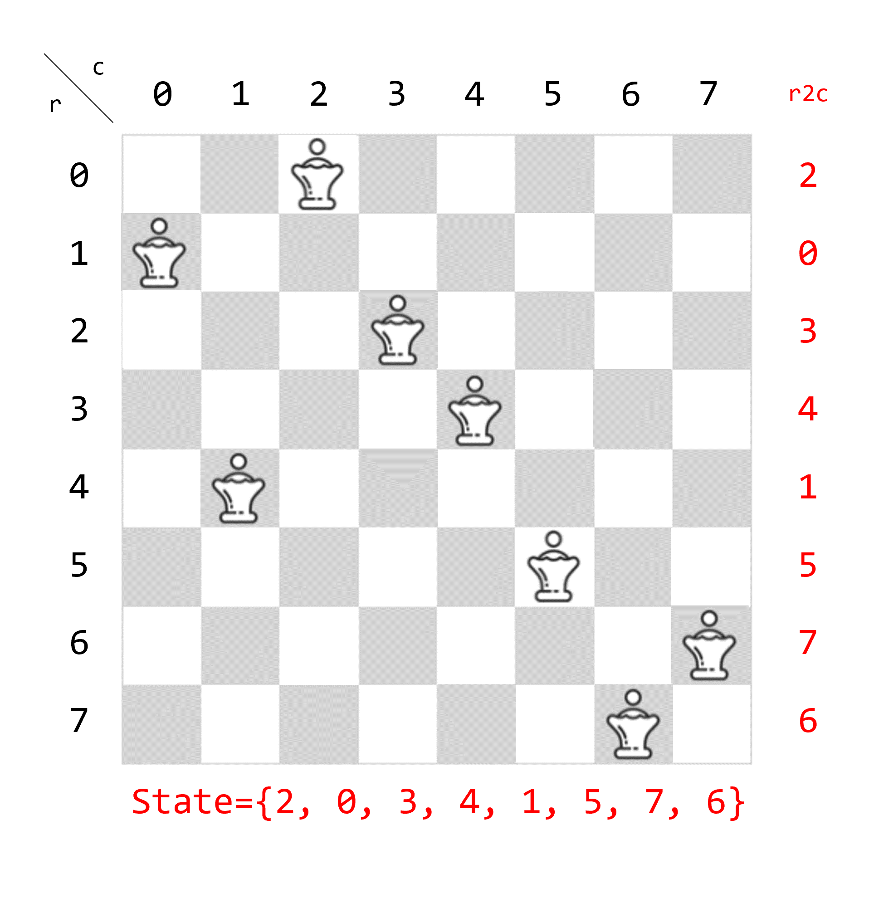
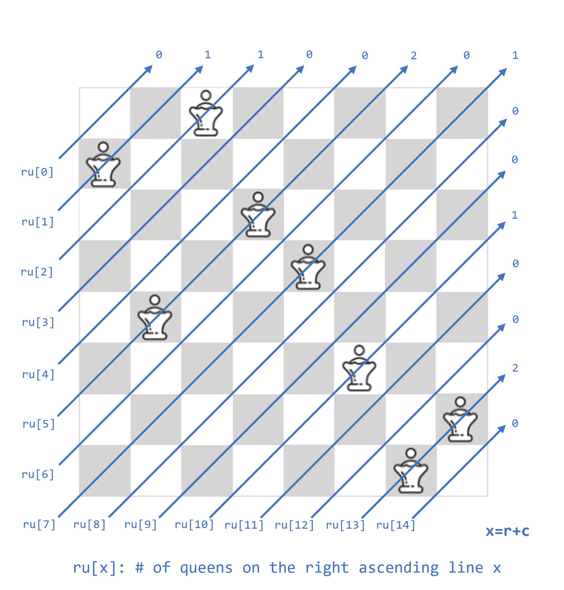
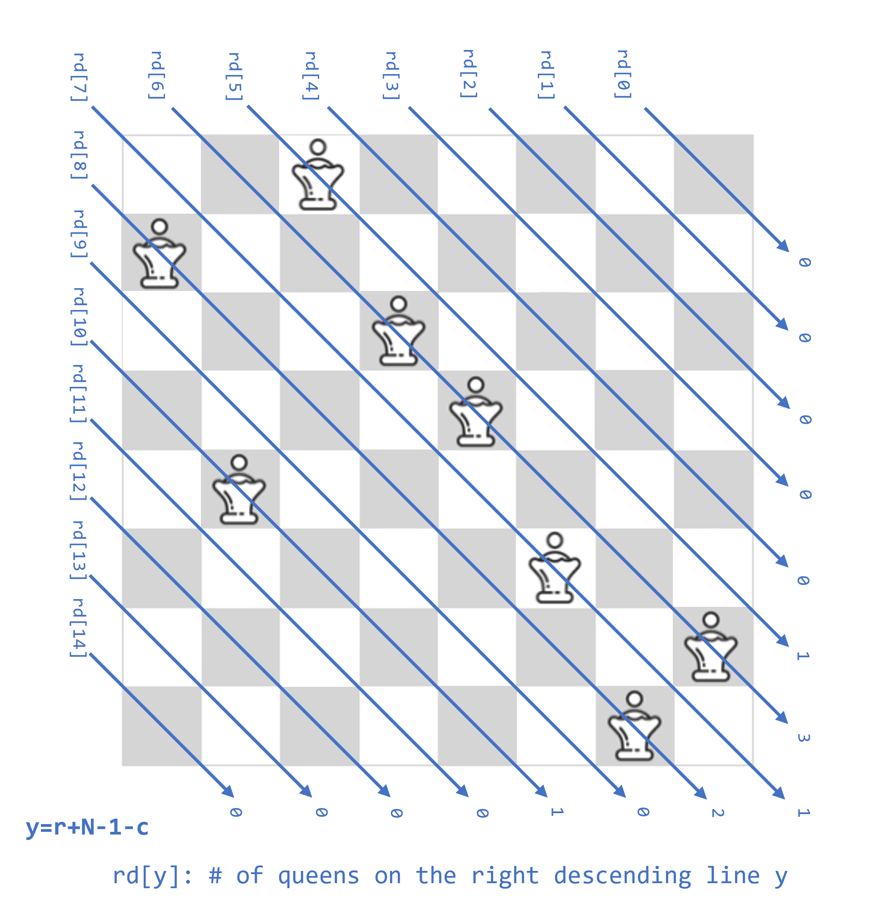
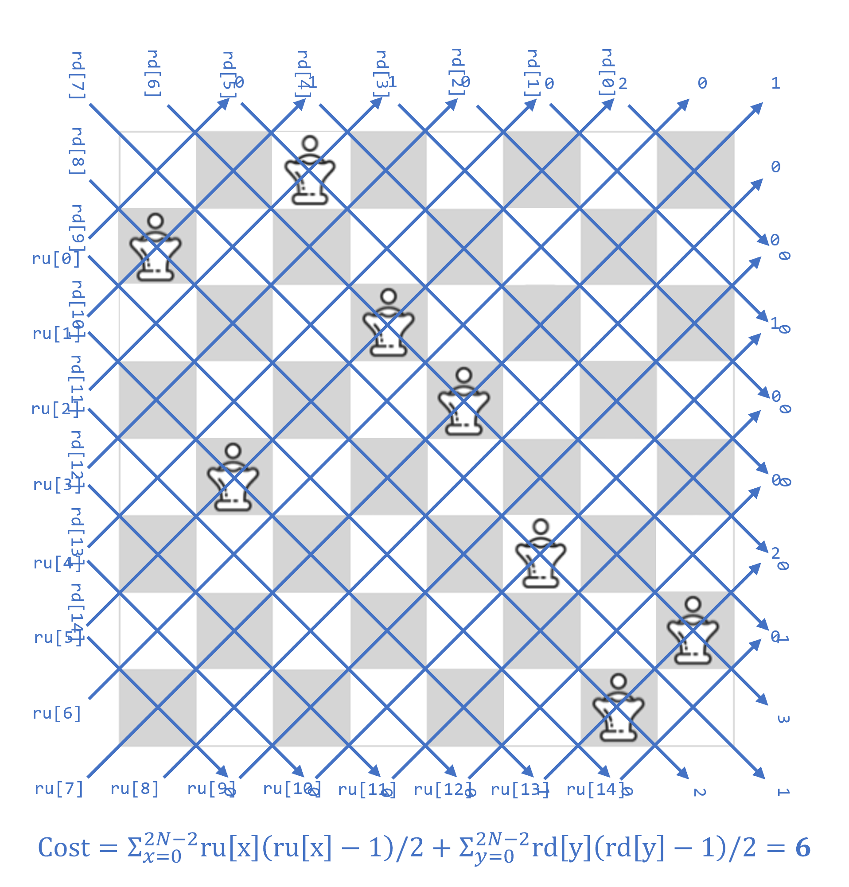
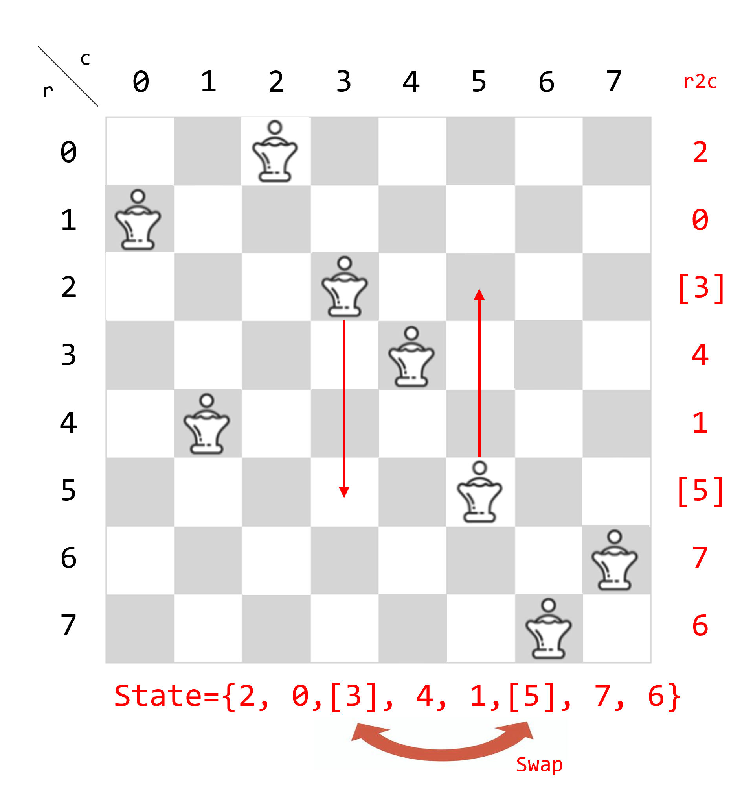
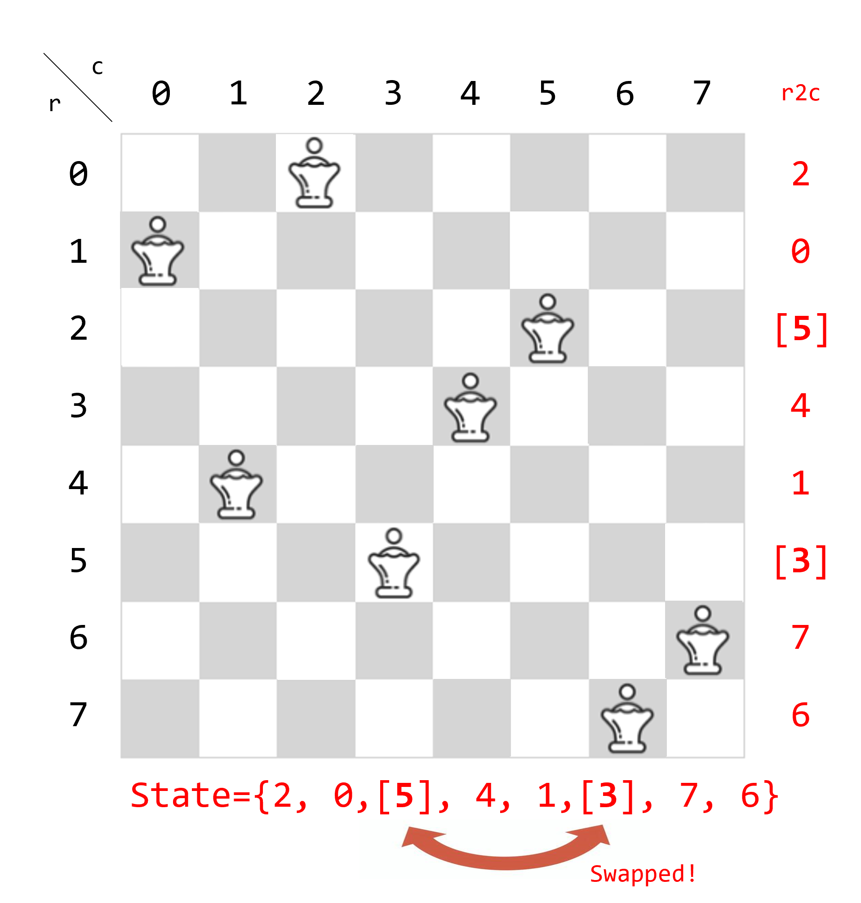

I rely mostly on ChatGPT translations. Sorry!

---

# MM150 - QueenAttack

---

[Problem Page](https://www.topcoder.com/challenges/fd5f10e0-34de-4fdc-9df1-6bd8681debf3)

Last Submission: [QueenAttack.cpp](QueenAttack.cpp)

---

## Overview

* Precompute the shortest path for all point pairs on the board with the queen removed. (obstacles are walls only)
* Generate a large number of target boards by annealing. The matching cost between the initial board and the target board is also calculated at the same time. (~5sec)
* Starting from the board with the lowest matching cost, do the following (~6sec)
  * Simulate ( using naive greedy method ) the sequence of moves that will bring the initial board closer to the target board and calculate the score.
  * Record the board as the "best target board" when the score is updated.
* Perform a local search for the "best target board", swapping the order of movement of pieces to improve the score. (~9sec)

---

### Speeding Up Simulated Annealing

* For simplicity, consider the general N queens problem.
* Assume a size N*N board with N queens, with only one queen per row and column.
* If the queen in row r is in column c<sub>r</sub>, then {c<sub>0</sub>, ..., c<sub>N-1</sub>} forms a permutation of {0, ..., N-1}.
  * <b>A state satisfying row and column constraints can be identified with the permutation {c<sub>0</sub>, ..., c<sub>N-1</sub>}.</b>


* Let ru[x] be the number of queens on the x-th upper right diagonal line.


* Let rd[y] be the number of queens on the y-th lower right diagonal line.


* The number of constraint violations is represented by the formula below.


* Consider how to minimize the number of diagonal constraint violations while satisfying row and column constraints.
  * <b>Just pick any two elements of the permutation and swap them. (this can be done in constant time)</b>
  * See implementation around L156~224 in the source code (`struct NQueen`).
  

* For cases with multiple sets of queens and walls (as in the problem):
  * Consider overlap cost in addition to diagonal cost mentioned above.
  * `overlap(r, c) = max(0, #queens(r, c) + (wall ? 1 : 0) - 1).`
  * This cost can also be calculated differentially in constant time.
  * Refer to L404~542 in the source code (`struct MultipulNQueen`).

* Simulated annealing to minimize diagonal constraint violation cost and overlap cost.
  * Temperature adjustment: reset the temperature every 2^20 iterations, as different seeds have different temperatures at which they are more likely to find a valid state.
  * 
  * Calculate the matching cost (theoretical minimum move cost) using the Hungarian method each time a valid state is found.

```
Number of valid states generated (using zobrist hash to remove duplicates)

seed  1: 678    (maybe all states)
seed  2: 20224
seed  3: 111787
seed  4: 100495
seed  5: 34267
seed  6: 26581
seed  7: 65900
seed  8: 86107
seed  9: 38751
seed 10: 49780
```

---

### Details of the Greedy Method
* See around L756~789 in the source code (`MoveGenerator::run()`).
```cpp
    void run() {
        // matching: List of matching between initial and target positions for N*C pieces.

        // Whether it has already moved from the initial position toward the target position.
        auto completed = make_vector(false, matching.size());

        while (true) {
            // Whether an update occurred.
            bool update = false;

            for (int id = 0; id < (int)matching.size(); id++) {
                auto [si, sj, ti, tj] = matching[id];

                // Already moved.
                if (si == ti && sj == tj) completed[id] = true;
                if (completed[id]) continue;

                if (is_free_path(id)) {
                    // Move along the shortest path if there are no obstacles.
                    move_free_path(id);
                    completed[id] = true;
                    update = true;
                }
                else {
                    auto [si, sj, ti, tj] = matching[id];
                    // 1. Penalty for moving along the (true) shortest path while moving other pieces out of the way.
                    //      Chain movements are not considered.
                    //      The order of other pieces' movements is predetermined.
                    double force_cost = calc_force_move_cost(id);
                    // 2. Penalty for moving along the shortest path without moving other pieces.
                    double dijkstra_cost = dijkstra(id) ? dist[ti * N + tj] : 1e9;
                    
                    if (std::min(dijkstra_cost, force_cost) != 1e9) {
                        // If movement is possible, choose the lesser cost of 1 and 2 and simulate movement.
                        if (dijkstra_cost < force_cost) {
                            dijkstra_move(id);
                            completed[id] = true;
                            update = true;
                        }
                        else {
                            force_move(id);
                            completed[id] = true;
                            update = true;
                        }
                    }
                }
            }
            // Break if no updates.
            if (!update) break;
        }
    }
```

---

### Impressions

* Faster board generation worked somewhat well.
* I couldn't come up with a clever algorithm for moving from the initial state to the target state. (Maybe that's the difference between me and the top...)

```
Final Submission Scores

seed  1: 17.528596717383735
seed  2: 431.7995090351847
seed  3: 42.07881016988197
seed  4: 45.384998355061484
seed  5: 215.05741613445187
seed  6: 135.4583129687399
seed  7: 111.90997824669118
seed  8: 24.58052242808634
seed  9: 194.27885428231164
seed 10: 191.53940220267856
```