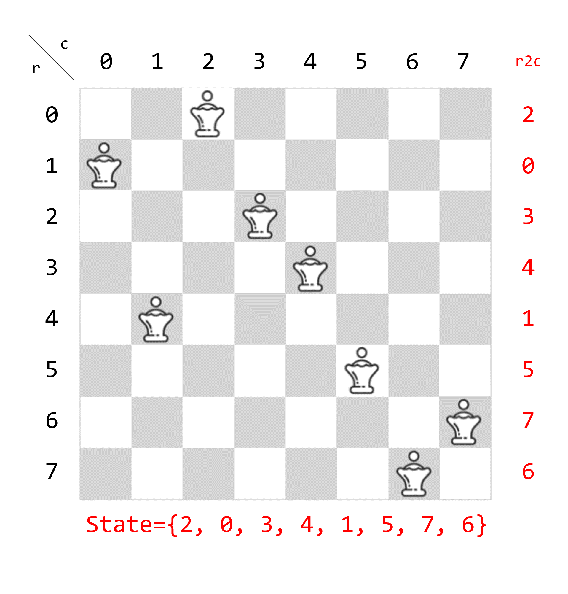
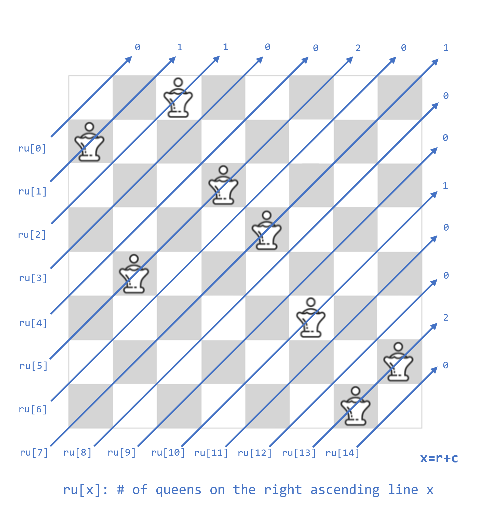
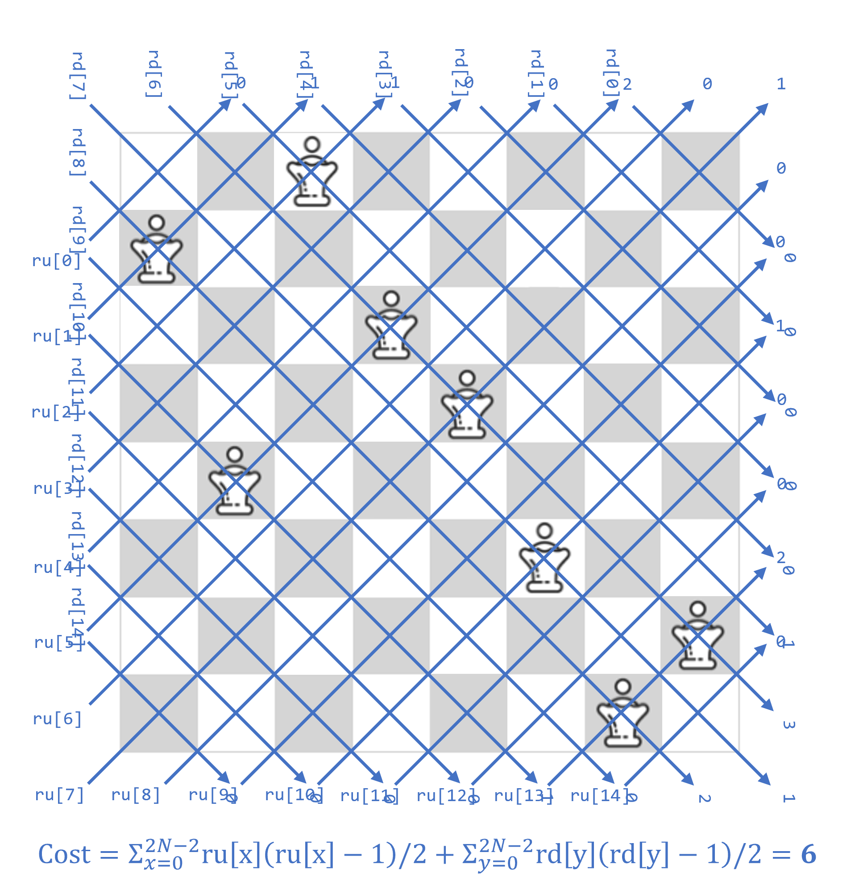
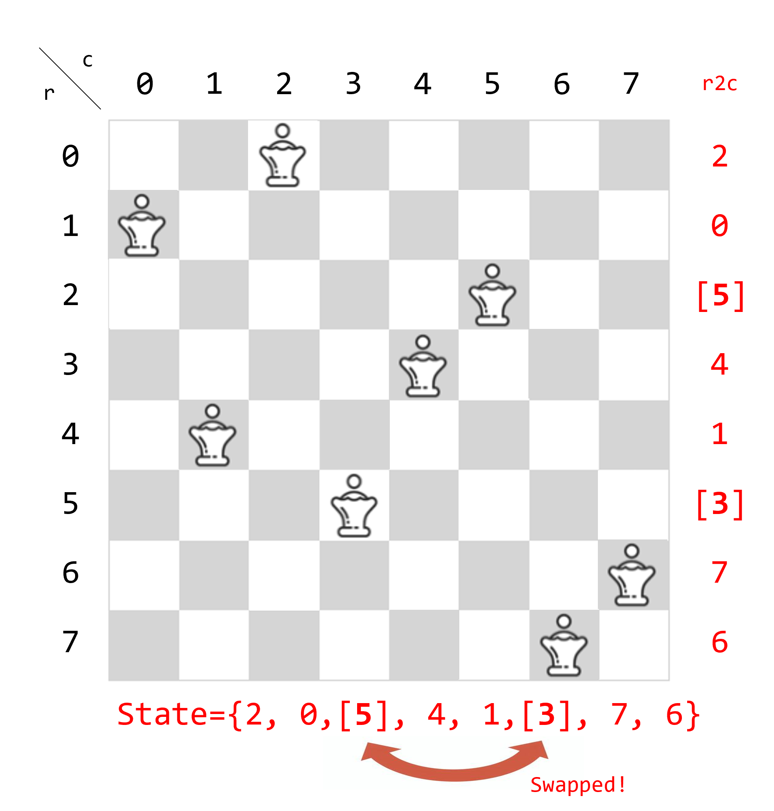

# MM150 - QueenAttack

---

<a href="https://www.topcoder.com/challenges/fd5f10e0-34de-4fdc-9df1-6bd8681debf3">問題ページ</a>

最終提出: <a href="QueenAttack.cpp">QueenAttack.cpp</a>

---

## 概要

* クイーンを取り除いた盤面における、全点対最短経路を前計算する（障害物は壁のみ）
* 焼き鈍しで目標盤面を大量生成する。初期盤面とのマッチングコストも同時に計算する。 (~5sec)
* マッチングコストの小さい目標盤面から順に、以下を行う (~6sec)
  * 初期盤面から目標盤面へ近付ける操作列を(ナイーブな貪欲法で)シミュレートして、スコアを計算する
  * スコアが更新されたら「ベストな目標盤面」として記録する
* 「ベストな目標盤面」に対して、移動する駒の順序を入れ替える局所探索を行い、スコアを改善する (~9sec)

---

### 焼き鈍しの高速化

* 簡単のためにクイーン 1 色かつ壁なしの、一般的な N クイーン問題を考える
* サイズ N*N の盤面に N 個のクイーンが存在し、どの行・列にも 1 つのクイーンしか存在しないとする
* r 行目のクイーンが c<sub>r</sub> 列目にあるとすると、{c<sub>0</sub>, ..., c<sub>N-1</sub>} は {0, ..., N-1} の順列になる
  * <b>行と列の制約を満たすような状態は、順列 {c<sub>0</sub>, ..., c<sub>N-1</sub>} と同一視可能</b>



* x 番目の右斜め上のラインに存在するクイーンの数を ru[x] とする


* y 番目の右斜め下のラインに存在するクイーンの数を rd[y] とする


* このとき、制約違反の個数は下図の式で表される


* 行と列の制約を満たしながら、斜めの制約違反の個数を最小化する
  * <b>順列 {c<sub>0</sub>, ..., c<sub>N-1</sub>} の二要素を選んで swap すればよい（定数時間）</b>
  * ソースコードの L156~224 付近に実装があります（`struct NQueen`）
  

* クイーンが複数セット存在し、壁もある場合（問題と同条件）
  * 上述の斜めコストに加えて、overlap cost を考慮する
  * `overlap(r, c) = max(0, #queens(r, c) + (wall ? 1 : 0) - 1).`
  * これも定数時間で差分計算可能
  * ソースコードの L404~542 参照（`struct MultipulNQueen`）

* 斜め制約違反コストと overlap cost を最小化する焼き鈍し
  * 温度調整: seed によって valid な状態を見つけやすい温度が異なるため、2^20 イテレーション毎に温度をリセットする
  * 
  * valid な状態を見つける度に、ハンガリアン法でマッチングコスト（理論値）を求めておく

```
(zobrist hash を用いて重複を除いた) valid な状態の生成数

seed  1: 678    (maybe all states)
seed  2: 20224
seed  3: 111787
seed  4: 100495
seed  5: 34267
seed  6: 26581
seed  7: 65900
seed  8: 86107
seed  9: 38751
seed 10: 49780
```

---

### 貪欲法の詳細
* ソースコード L756~789 付近（`MoveGenerator::run()`）
```cpp
    void run() {
        // matching: N*C 個の駒の、初期位置と目標位置の対応関係のリスト

        // 目標位置に達したかどうか
        auto completed = make_vector(false, matching.size());

        while (true) {
            // 更新が発生したかどうか
            bool update = false;

            for (int id = 0; id < (int)matching.size(); id++) {
                auto [si, sj, ti, tj] = matching[id];

                // 移動済み
                if (si == ti && sj == tj) completed[id] = true;
                if (completed[id]) continue;

                if (is_free_path(id)) {
                    // 最短経路上に障害物がない場合は、最短経路で移動させる
                    move_free_path(id);
                    completed[id] = true;
                    update = true;
                }
                else {
                    auto [si, sj, ti, tj] = matching[id];
                    // 1. 他の駒をどかしながら(真の)最短経路を進んだ場合のペナルティ
                    //      連鎖的な移動の発生は考慮できていない
                    //      他の駒の移動順序は決め打ち
                    double force_cost = calc_force_move_cost(id);
                    // 2. 他の駒をどかさないよう最短経路を進んだ場合のペナルティ
                    double dijkstra_cost = dijkstra(id) ? dist[ti * N + tj] : 1e9;
                    
                    if (std::min(dijkstra_cost, force_cost) != 1e9) {
                        // 移動可能なら、1 と 2 のコストが小さい方を採用して、移動をシミュレート
                        if (dijkstra_cost < force_cost) {
                            dijkstra_move(id);
                            completed[id] = true;
                            update = true;
                        }
                        else {
                            force_move(id);
                            completed[id] = true;
                            update = true;
                        }
                    }
                }
            }
            // 更新されなくなったら break
            if (!update) break;
        }
    }
```

---

### 雑感

* 盤面生成の高速化はある程度上手く行ったと思っている
* 目標盤面への賢い移動方法が思いつかなかったのが最上位との差かもしれない

```
最終提出のスコア

seed  1: 17.528596717383735
seed  2: 431.7995090351847
seed  3: 42.07881016988197
seed  4: 45.384998355061484
seed  5: 215.05741613445187
seed  6: 135.4583129687399
seed  7: 111.90997824669118
seed  8: 24.58052242808634
seed  9: 194.27885428231164
seed 10: 191.53940220267856
```